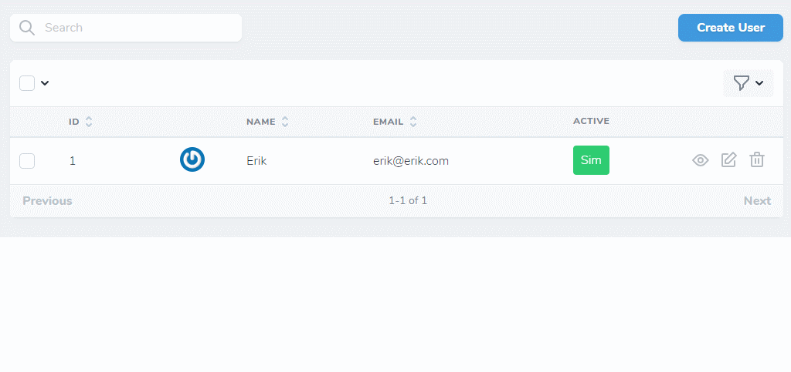
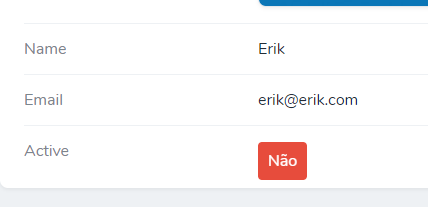

# Nova toggle on table

If you don't speak portuguese, click [here](./README_EN.md) 





## Instalação

Instale com o [Composer](https://getcomposer.org/).


```
composer require erikfig/nova-toggle-on-table
```

## Utilização

Apenas adicione o field adicionando o campo que quer gerenciar:

```
use Erikfig\NovaToggleOnTable\NovaToggleOnTable;

// ...

public function fields(Request $request)
{
    return [
        ID::make()->sortable(),

        // ...

        NovaToggleOnTable::make('Active'),
    ];
}

```

Você também pode usar o formato label/campo:

```
NovaToggleOnTable::make('Ativo', 'active')
```

## Tradução

O field usa o arquivo de tradução do Nova, aquele em `resources/lang/vendor/nova/en.json`, você pode traduzir editando diretamente ou criando um em outro prefixo, conforme o formato padrão do Laravel.

Existe um texto, o 'loading', caso queira traduzir, é só adicionar:

```
{
    // ...
    "Yes": "Sim",
    "No": "Não",
    "loading": "carregando",
    // ...
}
```

## Contribuições

Eu não espero contribuições, crie como forma de estudo, mas se quiser ajudar, pode traduzir este texto.

Aceito todo tipo de PRs, inclusive serei eternamente grato.
